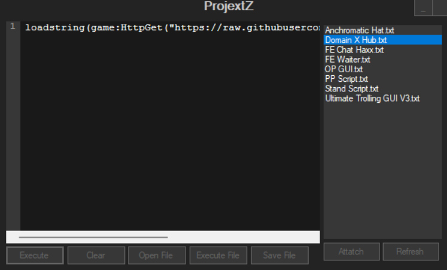
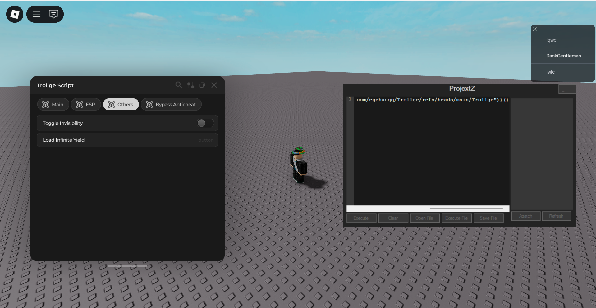

# ProjextZ
Frontend &amp; Mock API for Ethical Testing

  

---

## Purpose:
ProjextZ provides a sanitized WinForms frontend, a mock implementation of an API surface used for internal testing, and architecture documentation for building safe, auditable tooling for authorized security assessments. This repository is intended for developers, UI designers, and security teams who need a controlled environment to prototype UI flows, network interactions, and integration tests — without distributing or executing exploit code.

## Acknowledgments:
This project was developed with inspiration from research and public work in the exploit tooling community; specifically, we acknowledge the WeAreDevs ecosystem for historical context. This repository does not redistribute or link to their binaries or provide instructions for unauthorized use.

Nice — I’ll spell out a thorough, copy-paste-ready **Features** section you can drop into your README or repo page. I’ll describe what your current front-end actually does (based on the code you pasted), plus a few safe, clearly labeled **non-exploit / mock** features you should include so the repo is legitimate and safe to publish.

I’ll avoid any wording that teaches how to run exploits or distribute dangerous binaries — instead I’ll reference the API surface in a sanitized way (e.g., “mock `initialize()` / `execute()`”) so you can document functionality without enabling misuse.

---

## Suggested **Features** section (short)

**Features**

* Syntax-highlighted script editor (FastColoredTextBox)
* Load, save, and import scripts (`.lua`, `.txt`)
* Script library browser (populate scripts folder automatically)
* Execute scripts via a pluggable API interface (`initialize()`, `execute(script)`) — **mocked for safe testing**
* One-click run & run-from-file support
* Minimal, responsive WinForms UI (drag the window from anywhere)
* Minimize / close / clear editor UI controls
* Simple file dialogs and user prompts
* Designed for authorized, isolated testing only (no exploit binaries included)

---

## Suggested **Features** section (detailed — README ready)

### Features

* **Rich code editor**

  * Integrated `FastColoredTextBox` control for syntax highlighting and easy editing of Lua / text scripts.
  * Keyboard-friendly editing and basic file operations (open, save, clear).

* **Script management**

  * **Script Library**: Automatically populates a scripts list from `./Scripts` folder for quick selection and one-click loading.
  * **Open from disk**: Load a single script with an Open File dialog (`.lua`, `.txt`, or `*.*`).
  * **Save to disk**: Save current editor contents with Save File dialog.

* **Execution & test harness (SANITIZED)**

  * UI exposes an `initialize()` and `execute(script)` API surface so the frontend can connect to a backend implementation.
  * This repository ships a **mock API** that implements those methods safely for local testing (no DLL injection, no remote downloads, no binary payloads).
  * The UI supports "Run" (execute editor contents) and "Run from file" operations, all wired to the mock API by default.

* **Window & UX features**

  * **Drag anywhere** — click-and-drag the window from any point on the form (custom window chrome).
  * Minimize and close buttons integrated into the UI.
  * Simple status messaging and error handling for file operations.

* **Safe-by-design**

  * Any integration with real/native test components must be handled via private/internal artifact feeds or with explicit written authorization.

---

  

